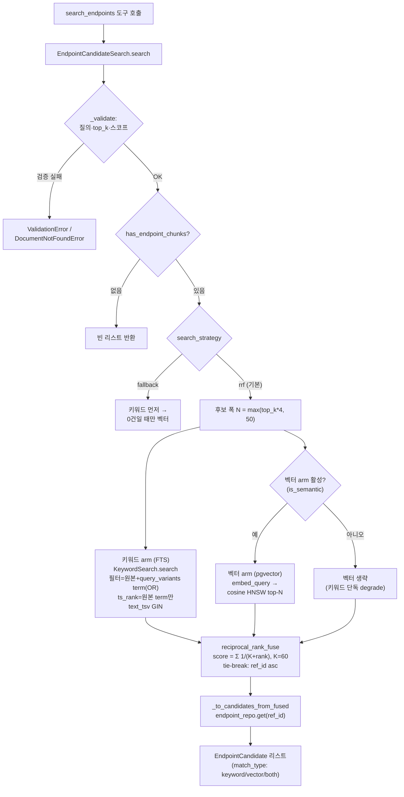
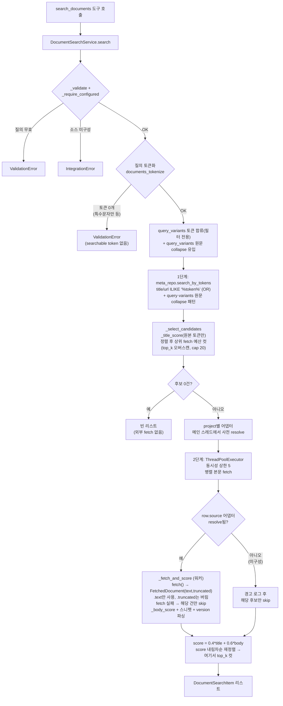

# 검색 로직 전체 흐름 (search-flow)

> **⚠️ 유지보수 안내 — 이 문서는 "살아있는 문서"다.**
> 검색 로직을 바꾸면 이 문서도 **같은 커밋에서 함께 갱신**해야 한다. 갱신 대상 코드:
>
> - `app/services/search/` (엔드포인트 검색: `endpoint_candidate_search.py`, `keyword_search.py`, `vector_search.py`, `rrf.py`, `tokenize.py`)
> - `app/services/documents/` (협업문서 검색: `document_search_service.py`, `search_scorer.py`, `snippet_generator.py`)
> - `app/repositories/chunk_repository.py` (FTS·벡터 SQL), `app/repositories/document_meta_repository.py` (문서 메타 ILIKE 필터)
> - `app/models/openapi.py` (`TEXT_TSV_EXPRESSION`, `text_tsv` 생성 컬럼·GIN 인덱스), `app/composition.py` (조립), `app/core/config.py` (전략 플래그)
>
> 코드와 이 문서가 어긋나면 신규 참여자가 잘못된 그림을 갖게 된다. **코드가 진실, 문서는 그 요약**임을 전제로, 흐름·파일·함수 위치가 바뀌면 반드시 반영한다.

- 최종 갱신: 2026-08-12 (developer: `query_variants`를 엔드포인트 키워드 arm에도 배선 — `docs/12-rag-depth-directions.md` 후보4)
- 작성: architect
- 관련 설계 근거: `docs/07-search-rrf-reevaluation.md`(RRF), `docs/04-search-p1-keyword-fts-design.md`(키워드 FTS), `docs/03-search-performance-improvements.md`(P1~P6), `docs/10-collab-docs-search-fixes.md`(항목1~6: version 파싱, truncated 노출 등), `docs/12-rag-depth-directions.md`(후보4: query_variants 확장)

---

## 1. 개요 — 두 개의 독립 검색 경로

이 프로젝트에는 **서로 완전히 독립된 두 검색 경로**가 있다. 대상 데이터·저장 방식·랭킹 전략이 다르므로 코드도 서비스도 분리돼 있다.

| 구분        | 엔드포인트 검색                                                 | 협업문서 검색                                               |
| ----------- | --------------------------------------------------------------- | ----------------------------------------------------------- |
| 서비스      | `EndpointCandidateSearch`                                       | `DocumentSearchService`                                     |
| MCP 도구    | `search_endpoints` (`app/mcp/tools/endpoints.py:30`)            | `search_documents` (`app/mcp/tools/documents.py:130`)       |
| 대상 데이터 | OpenAPI 문서에서 색인된 **endpoint 청크**(`api_chunk`, DB 내부) | Drive/Notion **협업 문서 본문**(외부 API, 실시간)           |
| 저장·인덱스 | Postgres: FTS(`text_tsv` GIN) + 벡터(`embedding` HNSW)          | Postgres 캐시는 **메타(제목/URL)만**, 본문은 미저장         |
| 랭킹 전략   | **키워드 + 벡터를 RRF로 항상 융합**(기본 `rrf`)                 | 제목 매칭 1단계 → 본문 fetch 후 점수 2단계                  |
| 특징        | 두 신호 순위 융합, 사내 데이터라 저지연                         | 외부 fetch 비용이 커 **후보를 top_k로 압축**한 뒤에만 fetch |

조립은 `app/composition.py`의 `build_services()`에서 이뤄진다(`candidate_search` 라인 209, `document_search_service` 라인 245).

---

## 2. 엔드포인트 검색 — 키워드 + 벡터 RRF 융합

`EndpointCandidateSearch.search` (`app/services/search/endpoint_candidate_search.py:108`)가 진입점이다.
**후보 식별 정보만**(endpoint_id·method·path·summary·match_type) 반환하고, 상세(파라미터·응답)는 `get_endpoint_details`가 담당한다.

### 2.1 전략 두 가지

`DOCS_MCP_SEARCH_STRATEGY` env(`app/core/config.py:40`, 기본 `rrf`)로 결정:

- **`rrf`(기본)**: 키워드·벡터 두 ranker를 **항상 병렬 실행**해 RRF로 융합. → `_search_rrf` (`:144`)
- **`fallback`(롤백 스위치)**: 키워드를 먼저 하고 **정확히 0건일 때만** 벡터를 보조로. 옛 SPEC Phase 0 결정 6번 동작. → `_search_fallback` (`:135`)

인식 못 하는 값은 안전하게 `rrf`로 degrade한다(문자열 비교 분기).

### 2.2 rrf 전략 단계별 흐름

1. **입력 검증·스코프 확정** — `_validate` (`:195`). 빈 질의·top_k 범위(1~50) 체크, `document_id`/`project` 스코프 해석(미등록 document_id는 `DocumentNotFoundError`로 구분).
2. **endpoint 청크 존재 확인** — `chunk_repo.has_endpoint_chunks` (`chunk_repository.py:121`). 스코프에 endpoint 청크가 아예 없으면 검색·임베딩 없이 즉시 `[]`.
3. **후보 폭 N 계산** — `width = max(top_k * 4, 50)` (`:169`, 상수 `_CANDIDATE_WIDTH_MULTIPLIER=4`, `_MIN_CANDIDATE_WIDTH=50`). 정답이 한쪽 arm 상위에만 있어도 융합에서 건지도록 top_k보다 넓게 조회한다.
4. **키워드 arm(FTS)** — `KeywordSearch.search` (`keyword_search.py:38`)
   - 질의를 `tokenize_terms`(`keyword_search.py:13`, 정규식 `[0-9A-Za-z_]+|[가-힣]+`, 소문자화)로 term 분해. 호출자(Claude)가 `CandidateSearchOptions.query_variants`로 동의어/유사 표현을 넘기면 같은 토크나이저로 분해해 필터 term 에 합류시킨다(**docs/12-rag-depth-directions.md** 후보4 — 협업문서 검색과 동일 규약: variant는 필터만 넓히고 점수엔 안 섞는다).
   - `chunk_repo.search_endpoint_by_text` (`chunk_repository.py:140`): 필터 term(원본+variant)들을 `|`(OR)로 결합해 `to_tsquery('simple', ...)`를 만들고, `api_chunk.text_tsv` **GIN 인덱스**(`ix_api_chunk_text_tsv`)에 `@@` 매칭. 각 term은 리터럴 lexeme으로 인용(`_quote_tsquery_lexeme`, tsquery 연산자 오인 방지). **`ts_rank` 점수는 별도 `score_terms`(원본 질의 term만, `query_variants` 생략 시 필터 term과 동일)로 계산**해, variant 매칭만 있는 후보가 원본 매칭 후보보다 부당하게 높은 순위를 받지 않게 한다. 정렬은 그 점수 내림차순, 동점이면 `id` 오름차순(결정적). 스코프(document_id/project)는 SQL WHERE + `ApiDocument` JOIN으로 필터.
   - `text_tsv`는 `TEXT_TSV_EXPRESSION`(`app/models/openapi.py:46`)으로 채워지는 STORED generated 컬럼 — ASCII↔한글 경계에 공백을 삽입한 뒤 `to_tsvector('simple', ...)`로 만든다(한글 단어·경로 세그먼트·혼합복합어 매칭).
   - 결과에서 `ref_id`(=endpoint_id) 순위 리스트를 뽑는다.
5. **벡터 arm(pgvector HNSW)** — 벡터 arm이 활성(`vector_fallback_enabled=True`, 즉 `is_semantic` 임베딩)일 때만:
   - `chunk_repo.list_endpoint_chunk_ids` (`chunk_repository.py:104`)로 스코프 내 endpoint 청크 ID 집합을 가볍게 조회(후보 제한용).
   - `VectorSearch.search` (`vector_search.py:32`): 질의를 `embedding_provider.embed_query`로 임베딩(로컬 `multilingual-e5-small`, `query:` 접두사 — `embedding_provider.py:146`). 로컬 provider는 같은 질의 재임베딩을 피하려 **쿼리 임베딩을 LRU 캐시**한다(`LocalEmbeddingProvider`, `functools.lru_cache`, 장수 `AppState`에 상주). `query_variants`는 이 arm에는 배선하지 않는다 — 벡터 arm은 이미 의미 유사도로 동의어/유사 표현을 흡수한다.
   - `chunk_repo.search_by_vector` (`chunk_repository.py:263`): 쿼리 실행 직전 `SET LOCAL hnsw.ef_search = max(100, top_k)`(`_HNSW_EF_SEARCH=100`, 트랜잭션 스코프)로 넓은 후보폭에서도 HNSW recall을 확보한다. 이어 pgvector 코사인 거리(`<=>`, `embedding` 컬럼의 **HNSW 인덱스** `ix_api_chunk_embedding_hnsw`/`vector_cosine_ops`)로 top-N, 유사도=`1-거리`. `ref_id`를 SQL로 함께 프로젝션(역매핑용 전체 적재 불필요). `candidate_ids IN (...)`로 후보 제한.
   - 점수 0 이하 후보는 제외하고 `ref_id` 순위 리스트를 뽑는다.
   - 벡터 arm 비활성(해시 폴백 등 `is_semantic=False`)이면 이 단계를 조용히 생략하고 **키워드 단독 순위로 degrade**.
6. **RRF 융합** — `reciprocal_rank_fuse` (`rrf.py:42`)
   - 각 arm에서 `ref_id` 첫 등장 기준 1-based 등수 부여(`_dedupe_first`).
   - `score(ref) = Σ_arm 1/(K + rank_arm(ref))`, `K=60`(`RRF_K`, 상수 고정·env 미노출). 해당 arm에 없으면 그 항은 0.
   - `match_type`: 양쪽 등장=`both`, 키워드만=`keyword`, 벡터만=`vector`.
   - 정렬: score 내림차순, **동점이면 ref_id 오름차순**(결정적 tie-break — 골든 회귀 테스트 전제). top_k로 컷.
7. **DTO 변환** — `_to_candidates_from_fused` (`:288`). `endpoint_repo.get(ref_id)`로 method/path/summary를 채워 `EndpointCandidate` 리스트 반환. 참조 깨진 ref_id는 경고 로그 후 건너뜀.

### 2.3 mermaid — 엔드포인트 검색(rrf)

---

## 3. 협업문서 검색 — 메타 1단계 → 병렬 fetch 2단계

`DocumentSearchService.search` (`app/services/documents/document_search_service.py:152`)가 진입점이다. 본문은 신선도 때문에 **절대 캐시하지 않으며**, 외부 fetch 비용이 크므로 **후보를 fetch 예산으로 압축한 뒤에만** 본문을 가져온다. fetch 예산은 top_k 자체가 아니라 top_k를 오버스캔한 값이다(3.1 5번) — title_score만으로 top_k 컷을 2단계 이전에 확정하면 본문에만 강하게 걸리는 문서가 fetch 기회조차 못 받기 때문.

### 3.1 1단계 — 메타 캐시 후보 압축 (무료·빠름)

1. **검증·소스 구성 확인** — `_validate`(`:399`)/`_validate_source`(`:411`)/`_require_configured`(`:424`). "결과 0건"과 "소스 미설정"을 구분하기 위해, 소스가 하나도 구성 안 됐으면 `IntegrationError`.
2. **질의 토큰화** — `documents_tokenize`(`search_scorer.py`)로 질의 토큰 집합 생성. 정규화된 질의가 특수문자만으로 이뤄지는 등 **토큰이 하나도 안 나오면** `search()`(`:173-175`)가 별도로 `ValidationError("query must contain at least one searchable token")`를 던진다 — 소스 미설정과 마찬가지로 "결과 0건"과 혼동되지 않도록 조용히 빈 리스트를 돌려주지 않는다.
3. **필터 토큰 확장** — 호출자(Claude)가 넘긴 `query_variants`(동의어)를 `_variant_tokens`(`:252`)로 토큰화해 **1단계 SQL 후보 필터에만** 합친다. 서버는 자체 LLM 질의 확장을 하지 않는다(그 판단은 호출측 모델의 몫). **점수 계산은 항상 원본 질의 토큰만** 사용. 토큰화와 별개로, `query_variants` 원문도 `_select_candidates`가 `queries=[query, *query_variants]`로 그대로 아래 4번의 collapse 매칭에 실어 보낸다(공백 유무 차이는 토큰화를 거치면 사라지므로 원문이 필요).
4. **SQL 후보 조회** — `meta_repo.search_by_tokens` (`document_meta_repository.py:~90`): `document_meta`의 title/url에 대해 토큰별 `ILIKE '%token%'` 를 OR로 결합(+ `queries`의 각 문자열—원본 질의와 variant 원문—을 공백 제거한 `collapse` 패턴도 OR, 중복 collapse 값은 dedup). title/url에는 **pg_trgm GIN 인덱스**(`ix_document_meta_title_trgm`/`ix_document_meta_url_trgm`, `gin_trgm_ops`)가 걸려 있어 선행 와일드카드 ILIKE도 인덱스로 처리된다(캐시 규모가 커질 때 seq scan 회피). 스코프(source/project)는 SQL WHERE. `(source, external_id)` 순 결정적 정렬. **점수·순위는 SQL이 아니라 Python이** 정한다(SQL은 "가능성 있는 행"만 좁힘).
5. **후보 점수·정렬·컷** — `_select_candidates` (`:262`): `_title_score`(원본 토큰만)로 채점 후 (원본 매치 여부 내림차순, title_score 내림차순, external_id) 정렬 → **상위 fetch 예산 건만** 남긴다. 예산은 `_body_fetch_budget(top_k, candidate_count)`(`:~54`)가 정한다: `overscan = min(top_k*BODY_FETCH_OVERSCAN, MAX_BODY_FETCH_CANDIDATES)`(각각 3, 20), `budget = min(max(top_k, overscan), candidate_count)` — top_k보다 넓게 오버스캔하되 상한을 씌우고, top_k 자체보다는 작아지지 않으며, 후보 수를 넘지 않는다. 예산이 부족하면 원본 신호 있는 행이 먼저 자리를 채우고 variant-only 매치는 남는 자리만 채운다. **최종 top_k 컷은 여기가 아니라 2단계(`_rank_with_body`)가 본문 점수까지 반영해서** 한다 — title_score만으로 top_k 컷을 확정하지 않기 위한 것이 이 예산 확장의 목적.
6. **후보 0건이면 즉시 종료** — 외부 API를 **한 번도 호출하지 않고** 빈 리스트 반환(`:184`).

### 3.2 2단계 — 후보 본문 실시간 병렬 fetch (비쌈)

`_rank_with_body` (`:308`):

1. **어댑터 사전 resolve(메인 스레드)** — 후보에 등장하는 project별로 `resolver.resolve_for_project`를 **미리** 호출해 둔다. 이 호출은 요청-스코프 SQLAlchemy Session을 읽어 스레드 세이프하지 않으므로 워커에 맡기지 않는다.
2. **병렬 fetch** — `ThreadPoolExecutor(max_workers=min(len(candidates), MAX_CONCURRENT_BODY_FETCHES))`. **동시성 상한 `MAX_CONCURRENT_BODY_FETCHES=5`**(`:71`)가 Drive/Notion rate limit·지연 합산을 막는 핵심 장치다. `executor.map`은 입력 순서로 결과를 모아 스레드 안전.
3. **건별 fetch+채점** — `_fetch_and_score` (`:352`): 워커 스레드에서 순수 I/O인 `document_source.fetch()`만 수행. **후보의 `row.source`에 해당하는 어댑터가 1번에서 resolve된 `sources`에 없으면**(`sources.get(row.source) is None`, `:366-371`) `fetch()` 호출조차 없이 경고 로그 후 그 후보만 조용히 skip한다 — 메타 캐시엔 남아 있지만 해당 project의 소스 어댑터가 미구성된 경우로, 아래 `IntegrationError` 예외 경로와는 별개의 실패 분기다. `fetch()`는 평문 문자열이 아니라 `FetchedDocument(text, truncated)`(`sources/document_source.py:40`)를 반환한다 — 이 경로는 `.text`만 스니펫/점수 계산에 쓰고 **`.truncated`는 버린다**(스니펫은 원래 발췌라 절단 여부가 무의미; `truncated`는 `get_document` 원문 조회 경로에만 노출된다). **개별 fetch 실패는 그 문서만 건너뛴다**(한 건의 권한 오류가 검색 전체를 죽이지 않음, `None` 반환). 성공 시 `_body_score`(원본 토큰) + 스니펫(`_build_snippet`/`_fallback_snippet`) 생성 + `DocumentSearchItem.version = parse_version(row.title)`(제목에서 버전 표기 파싱, 없으면 None — **순위 계산에는 영향 없음**, 노출용 필드).
4. **최종 점수·정렬·top_k 컷** — `score = round(0.4*title_score + 0.6*body_score, 4)`(`TITLE_SCORE_WEIGHT=0.4`). fetch 순서와 무관하게 (score 내림차순, title) 재정렬한 뒤 **여기서 비로소 상위 top_k만** 남겨 반환한다(`items[:top_k]`) — 1단계에서 fetch 예산만큼 살아남은 후보가 본문 점수까지 반영해 재평가된 결과다.

### 3.3 mermaid — 협업문서 검색

---

## 4. 두 경로의 공통 원칙 (설계 메모)

- **스코프 필터는 SQL로** — 두 경로 모두 document_id/project/source 범위를 Python이 아니라 SQL WHERE(+JOIN)로 좁힌다. 전체 행을 메모리에 적재하지 않는다.
- **질의 확장은 호출측 LLM의 몫** — 서버는 동의어/약어 확장을 위해 별도 LLM을 호출하지 않는다. 두 경로 모두 호출자가 넘긴 `query_variants`를 **키워드 후보 필터(FTS OR / ILIKE)에만** 쓰고 점수는 원본 질의 토큰만으로 계산한다(`docs/12-rag-depth-directions.md` 후보4). 엔드포인트 검색의 벡터 arm은 `query_variants`를 받지 않는다 — 이미 의미 유사도로 동의어/유사 표현을 흡수하기 때문이다.
- **결정성** — 두 경로 모두 동점 tie-break를 고정 키(ref_id / external_id / title)로 못박아 결과가 결정적이다(엔드포인트 검색은 골든 회귀 테스트 전제).
- **"없음"의 구분** — 미등록 document_id·미구성 소스는 빈 결과가 아니라 명시적 오류로 구분해, 호출 LLM이 "문서 없음"과 "결과 없음"을 혼동하지 않게 한다.
