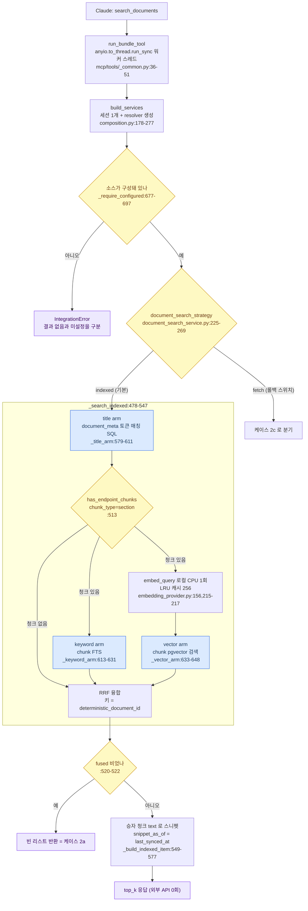
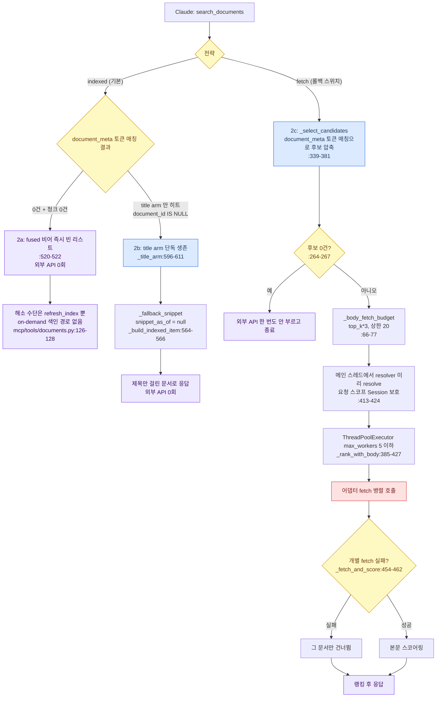
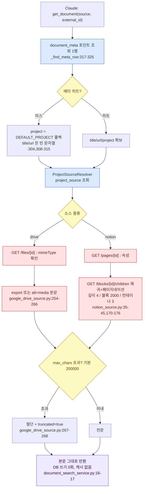
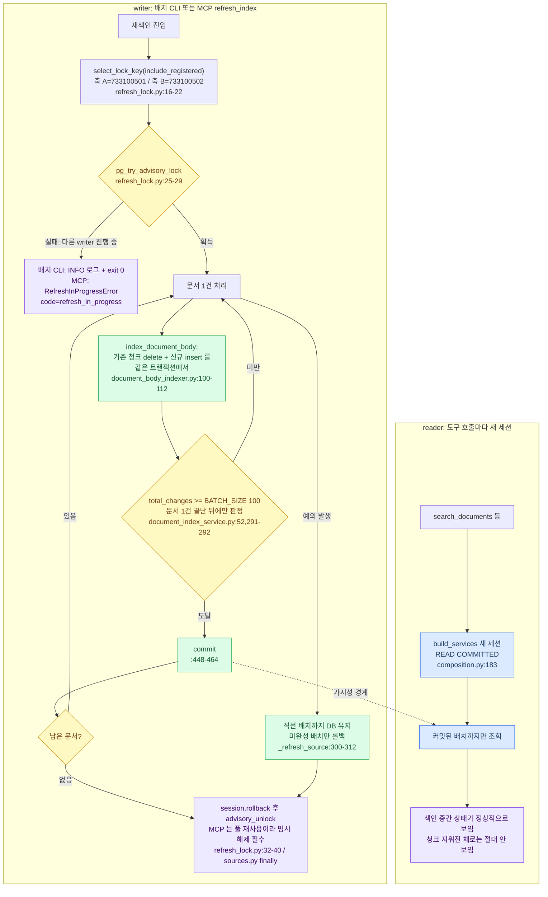
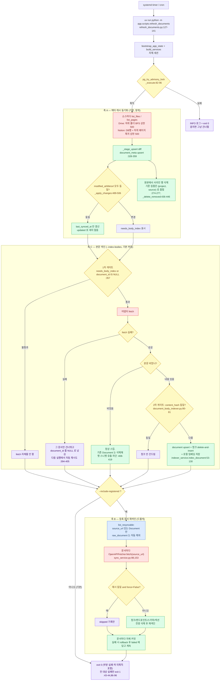
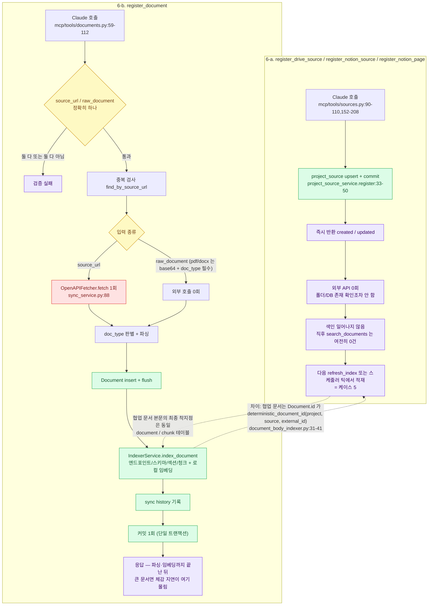
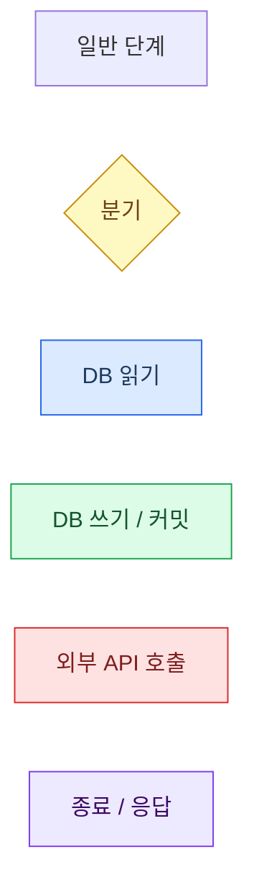
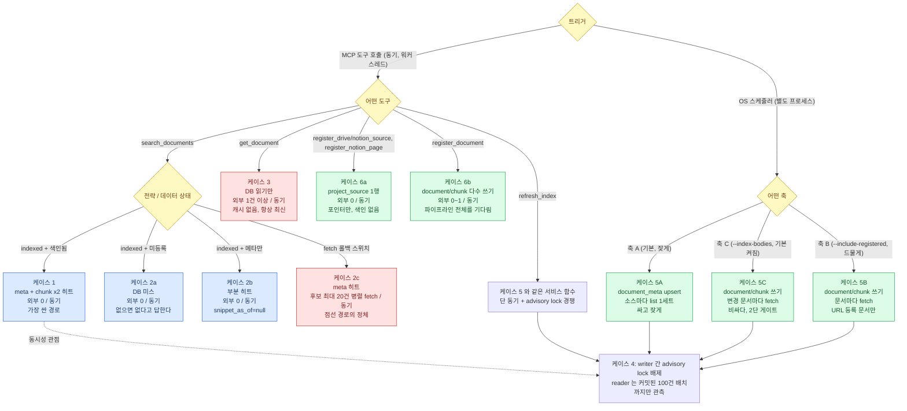

# 49. 데이터 흐름 시나리오별 정리 및 플로우 차트 (발표 다이어그램 보완 자료)

- 작성: architect
- 대상: `docs/architecture-presentation-diagram.html` 보완 설명
- 근거: 코드 기준(2026-08-17, `main` @ 023e1a9), 다이어그램은 `main` @ 7fe2adb 기준 재확인

각 케이스는 서술 다음에 바로 mermaid 플로우차트를 붙였다. 색 규칙(부록 C 범례)은 문서 전체에 동일하게
적용된다 — 파랑/청록/빨강/주황/초록/보라 = 케이스 1~6, 노드 색은 DB 읽기/DB 쓰기/외부 API/분기/종료를 가리킨다.

> **다이어그램 갱신점(케이스 4).** 이 문서 작성 시점(@023e1a9)에는 advisory lock 이 배치 CLI 에만
> 있었고 MCP `refresh_index` 에는 없었다. 7fe2adb 에서 두 경로가 `app/services/documents/refresh_lock.py`
> 의 같은 락 키를 공유하도록 바뀌어, 아래 케이스 4 다이어그램은 **현재 코드 기준**으로 그렸다.
> "MCP 도구에는 락이 없다" 항목은 이제 해소된 리스크다(본문 케이스 4 절 참조).

## 0. 전제 — 모든 시나리오에 공통으로 깔리는 3가지

1. **MCP 도구는 전부 `async def` 이지만 본문은 동기 실행이다.**
   `run_bundle_tool` 이 `anyio.to_thread.run_sync` 로 워커 스레드에 넘겨 실행하고,
   호출자는 그 결과를 기다린다(`app/mcp/tools/_common.py:36-51`).
   **백그라운드 작업 큐가 없다** — 색인이 필요한 도구는 색인이 끝나야 응답한다.
   진짜 비동기(호출자가 기다리지 않는) 경로는 OS 스케줄러가 도는 별도 프로세스
   (`app/scripts/refresh_documents.py`) 하나뿐이다.
2. **DB 세션은 도구 호출 1회당 1개다.** `build_services` 가 세션·저장소·서비스·
   `ProjectSourceResolver` 를 매 호출마다 새로 만들고 끝나면 닫는다
   (`app/composition.py:178-277`). 그래서 `register_drive_source` 로 매핑을 바꾸면
   서버 재시작 없이 다음 호출부터 반영된다.
3. **임베딩은 외부 API 가 아니다.** 로컬 CPU SentenceTransformer 를 쓴다
   (`app/services/indexer/embedding_provider.py:141-222`). 발표에서 "임베딩 =
   OpenAI 호출" 로 오해받기 쉬운 지점 — 외부 호출은 Drive/Notion/OpenAPI URL 뿐이다.

외부 API 호출 지점은 딱 3곳이다.

| 호출처 | 대상 | 코드 |
| --- | --- | --- |
| `GoogleDriveSource.list_files/fetch` | Drive REST v3 (httpx) | `google_drive_source.py:195,225` |
| `NotionSource.list_pages/fetch` | Notion API v1 (httpx) | `notion_source.py:109,149` |
| `OpenAPIFetcher.fetch` | 등록 문서 `source_url` | `sync_service.py:88,153` |

---

## 케이스 1 — 검색 요청, 대상 문서가 이미 색인돼 있음

```
Claude → search_documents
      → run_bundle_tool(스레드) → build_services(세션 1개)
      → DocumentSearchService.search  [전략 = indexed]
         ├ title arm   : document_meta 토큰 매칭 (SQL)
         ├ keyword arm : chunk FTS  (chunk_type='section', doc_types=[drive,notion])
         └ vector arm  : embed_query(로컬) → pgvector 검색
      → RRF 융합 → 승자 청크 text → 스니펫 → top_k
```

| 항목 | 값 |
| --- | --- |
| 컴포넌트 | `mcp/tools/documents.py:114-164` → `document_search_service.py:225-269` → `_search_indexed:478-547` |
| DB | **전부 히트**. `document_meta`(`_title_arm:579-611`), `chunk` FTS(`_keyword_arm:613-631`), `chunk` 벡터(`_vector_arm:633-648`), `project_source`(`_require_configured:677-697`) |
| 외부 API | **0회** — 이 경로엔 라이브 fetch 자체가 없다 |
| 동기/비동기 | 동기(호출자 대기), 서버 내부는 워커 스레드 1개 |

세부 근거:

- 벡터 arm 의 질의 임베딩은 **요청당 1회**다(`_vector_arm:643`). 후보마다 부르는 N+1 은
  doc37 §1.2 에서 반려됐다. `LocalEmbeddingProvider.embed_query` 는 LRU 캐시(256)까지 탄다
  (`embedding_provider.py:156,215-217`).
- keyword/vector arm 은 `has_endpoint_chunks(chunk_type='section')` 가 True 일 때만 돈다
  (`document_search_service.py:513`) — 청크가 하나도 없는 DB 에서 헛 SQL 을 안 쏜다.
- 스니펫은 승자 청크 text 에서 만들고, `snippet_as_of = document_meta.last_synced_at` 로
  "언제 시점의 본문인가"를 응답에 실어 보낸다(`_build_indexed_item:549-577`).
- `search_endpoints`(OpenAPI 경로)도 같은 성질이다 — 전부 DB, 외부 호출 0
  (`services/search/endpoint_candidate_search.py`).

발표용 한 줄: **가장 흔한 경로이자 가장 싼 경로. 네트워크 0회, DB 3-arm.**



- `project_source` 조회(resolver)도 DB 읽기다 — 그림에서는 `CFG` 게이트에 합쳐 두었다.
- 질의 임베딩은 **요청당 1회**이며 외부 호출이 아니다(로컬 SentenceTransformer).

---

## 케이스 2 — 검색/조회 요청인데 DB에 아직 없음

이 케이스는 **세 갈래로 갈리며, 결과가 서로 다르다.** 발표에서 뭉뚱그리면 안 되는 지점.

### 2-a. 메타도 본문도 없음 (`search_documents`)

- title arm 0건 + keyword/vector arm 0건 → `fused` 가 비어 **즉시 빈 리스트**
  (`document_search_service.py:520-522`).
- **외부 API 0회.** 서버는 "없으니 지금 가서 가져오자"를 하지 않는다 —
  on-demand 색인 경로가 존재하지 않는다.
- 해소 수단은 `refresh_index` 실행(케이스 5) 뿐이다. 도구 docstring 에도 그렇게 적혀 있다
  (`mcp/tools/documents.py:126-128`).
- 단, 소스가 아예 구성되지 않았으면 빈 리스트가 아니라 `IntegrationError` 다 —
  "결과 없음"과 "서버 미설정"을 일부러 구분한다(`_require_configured:677-697`).

### 2-b. 메타는 있는데 본문 미색인 (`document_meta.document_id IS NULL`)

- title arm 단독으로 결과에 남는다. 융합 키가 `deterministic_document_id` 라
  색인 여부와 무관하게 같은 키 공간에서 만나기 때문에 **별도 폴백 분기가 없다**
  (`_title_arm:596-611`, doc37 §2.3).
- 스니펫은 청크가 없으니 `_fallback_snippet`, `snippet_as_of=None`
  (`_build_indexed_item:564-566`). 응답만 봐도 "제목만 걸린 문서"임을 알 수 있다.
- 외부 API 0회.

### 2-c. 롤백 스위치 `document_search_strategy="fetch"` 인 경우

기본값이 아니지만 다이어그램의 "점선 = fetch degrade" 가 가리키는 경로라 정리한다.

- 1단계: `document_meta` 토큰 매칭으로 후보 압축(`_select_candidates:339-381`).
  **후보 0건이면 외부 API 를 한 번도 부르지 않고 종료**(`:264-267`).
- 2단계: 후보 상위 `_body_fetch_budget` 건만 본문 라이브 fetch
  (`:66-77`, `top_k*3`, 상한 20) → `ThreadPoolExecutor(max_workers≤5)` 병렬
  (`_rank_with_body:385-427`).
- 개별 fetch 실패는 그 문서만 건너뛴다(`_fetch_and_score:454-462`).
- 주의할 설계점: resolver 는 요청 스코프 Session 을 읽으므로 **메인 스레드에서 미리
  resolve** 하고 워커에는 순수 I/O 인 `fetch()` 만 넘긴다(`:413-424`).

발표용 한 줄: **"DB에 없으면 서버가 대신 가져다준다"가 아니다. 기본 경로는 없으면 없다고 답한다.**

2a/2b 는 케이스 1 과 같은 코드 경로의 다른 데이터 상태이고, 2c 만 별도 코드 경로다.



---

## 케이스 3 — `get_document` 로 원문 실시간 조회

```
Claude → get_document(source, external_id)
      → document_meta 포인트 조회 (title/url/project 확보용, 1행)
      → ProjectSourceResolver → 어댑터
      → 어댑터.fetch()  ← 외부 API (여기가 유일한 목적)
      → 본문 그대로 반환 (DB 쓰기 없음, 캐시 없음)
```

| 항목 | 값 |
| --- | --- |
| 컴포넌트 | `mcp/tools/documents.py:166-185` → `document_search_service.get_document:271-315` |
| DB | **읽기 2회**: `document_meta` 포인트 조회(`_find_meta_row:317-325`), `project_source`(resolver). **쓰기 0회** |
| 외부 API | **필수 1건 이상.** Drive: `GET /files/{id}`(mimeType) + export 또는 `alt=media`(`google_drive_source.py:254-266`). Notion: `GET /pages/{id}`(속성) + `/blocks/{id}/children` 재귀·페이지네이션(`notion_source.py:170-176`) |
| 동기/비동기 | 동기. 문서가 크면 이 도구가 세션에서 가장 느린 호출이 된다 |

세부:

- **본문은 절대 캐시하지 않는다.** 항상 호출 시점의 최신 원문이다
  (`document_search_service.py:16-17`).
- 메타 캐시 미스여도 실패가 아니다 — `project` 를 `DEFAULT_PROJECT` 로 폴백해 fetch 하고,
  `title`/`url` 만 `""` 로 나간다(`:304,308-315`). `content` 는 그래도 최신 원문이다.
- 절단 상한: Drive/Notion 모두 `max_chars`(기본 200,000) 로 자르고 `truncated` 를 실어 보낸다
  (`google_drive_source.py:267-268`, `notion_source.py:175-176`).
- Notion 재귀 상한: 블록 깊이 4 / 블록 2000 / 컨테이너 깊이 3
  (`notion_source.py:35-45`) — 무한 재귀·과금 폭주 방지.



---

## 케이스 4 — 색인이 도는 중에 동시에 요청이 들어옴

핵심: **읽기와 쓰기는 서로 다른 세션(대부분 다른 프로세스)이고, 커밋 경계가 100건이다.**

| 항목 | 값 |
| --- | --- |
| 읽기 측 | 도구 호출마다 새 세션(`composition.py:183`), READ COMMITTED |
| 쓰기 측 | 배치 프로세스 또는 `refresh_index` 도구, `BATCH_SIZE=100` 마다 커밋(`document_index_service.py:52,448-464`) |
| 결과 | 검색은 **커밋된 배치까지만** 본다. 색인 중간 상태(일부 문서만 최신)가 정상적으로 보인다 |

지켜지는 것:

- **문서 1건의 재색인은 리더에게 원자적으로 보인다.** `index_document_body` 는 기존 청크
  delete → 새 청크 insert 를 같은 트랜잭션에서 하고(`document_body_indexer.py:100-112`),
  커밋 경계 판정은 문서 1건 처리가 끝난 **뒤에만** 일어난다
  (`document_index_service.py:291-292`). 그래서 "청크가 지워졌는데 아직 안 채워진" 상태가
  커밋돼 검색에 노출되는 일은 없다.
- **부분 실패가 남는다.** 도중에 터져도 직전 배치까지는 DB 에 남고, 미완성 배치만 롤백된다
  (`_refresh_source:300-312`). 집계도 **실제 커밋된 것만** 센다.
- **커밋 경계 카운터에 `fetched_bodies` 가 포함된다**(`_SourceCounts.total_changes:91-101`).
  이게 없으면 메타 무변경 백필에서 카운터가 영영 0 이라 소스 하나를 다 끝내야 커밋되고,
  마지막에 1건 실패하면 본문 색인 전량이 롤백된다.

리스크로 남는 것(발표에서 "지금은 이렇게 막고 있다"로 말할 지점):

- **advisory lock 은 배치 CLI 에만 있다.** `refresh_documents.py:75-79` 가
  `pg_try_advisory_lock` 으로 축 A(733100501)/축 B(733100502) 를 따로 잠근다.
  **MCP `refresh_index` 도구에는 락이 없다**(`mcp/tools/sources.py:27-88`).
  즉 배치가 도는 중에 사용자가 `refresh_index` 를 부르면 두 writer 가 같은
  `document_meta` 행에 동시에 붙을 수 있다(UniqueConstraint `(project, source, external_id)`,
  `models/document_meta.py:48-51`). 현재는 "사람이 동시에 부르지 않는다"에 기대고 있다.
- 축 A/B 를 다른 락 키로 가른 이유는 주기 차이다(1시간 vs 1일) — 무거운 축 B 가 가벼운 축 A 의
  틱을 굶기지 않게 한다(`refresh_documents.py:20-23`).



---

## 케이스 5 — OS 스케줄러 주기 갱신 (축 A / B / C)

```
systemd timer(cron) → uv run python -m app.scripts.refresh_documents [옵션]
   → bootstrap_app_state → build_services (자체 세션)
   → pg_try_advisory_lock  ── 실패 시 INFO 로그 + exit 0 (겹치면 그냥 건너뜀)
   → document_index_service.refresh(source, project, index_bodies)   … 축 A(+C)
   → [--include-registered] resync_registered_documents(...)          … 축 B
   → exit 0 / 1
```

진입점: `app/scripts/refresh_documents.py:127-141`(`run`), `:82-124`(`_execute`).
종료코드: 전 대상 실패만 `1`, 부분 실패·락 미획득은 `0`(`:43-44,86-96`).
MCP 도구 `refresh_index` 와 **같은 서비스 함수**를 부르므로 즉시 실행 경로와 정기 실행 경로의
동작이 항상 일치한다.

### 축 A — 메타 캐시 동기화 (기본, 잦게)

| 항목 | 값 |
| --- | --- |
| 코드 | `document_index_service.refresh:151-222` → `_refresh_source:251-326` |
| 외부 API | (project, source) 쌍마다 `list_files()` 1세트(페이지네이션 포함). Drive 는 하위 폴더 BFS(상한 500, `google_drive_source.py:203-223`), Notion 은 DB 행 + 하위 페이지 재귀(상한 500, `notion_source.py:109-143`) |
| DB | `document_meta` diff upsert(`_stage_upsert:328-359`), 원본에서 사라진 행 삭제(`_delete_removed:436-446`) |
| 판정 | `modified_at`/title/url 이 모두 같으면 `last_synced_at` 만 갱신하고 `updated` 로 세지 않는다(`_apply_changes:489-506`) |

삭제 감지 기준 집합은 **`(project, source)` 로 좁힌 기존 행**이다
(`:274-277`). 여러 프로젝트가 같은 `source_name` 을 공유하므로, 이걸 안 좁히면
다른 프로젝트 행이 "원본에서 사라진 것"으로 오인돼 지워진다 — 기능 6 의 핵심 위험.

### 축 C — 협업 문서 본문 색인 (`--index-bodies`, 기본 켜짐)

축 A 와 **같은 실행에 얹히는 플래그**다. 별도 축이 아니라 축 A 의 옵션.

| 항목 | 값 |
| --- | --- |
| 코드 | `_index_body:361-434` → `document_body_indexer.index_document_body:56-113` |
| 1차 게이트 | `needs_body_index or row.document_id is None`(`:357`) — 메타가 안 바뀌었고 이미 색인됐으면 **fetch 자체를 안 한다** |
| 2차 게이트 | fetch 한 문서에 한해 `content_hash` 비교(`document_body_indexer.py:80-81`) — 같으면 청크를 안 건드린다 |
| 외부 API | 게이트를 통과한 문서마다 `fetch()` 1건 이상 (문서당 비용이 축 A 보다 훨씬 크다) |
| DB | `document` upsert + 청크 delete-and-insert + 로컬 임베딩 저장(`indexer_service.index_document:53-130`) |
| 실패 처리 | fetch 실패는 그 문서만 건너뛰고 `document_id` 를 NULL 로 남겨 **다음 실행에서 자동 재시도**(`:394-405`) |
| 빈 본문 | 오류가 아니라 정상 스킵. 전에 색인돼 있었으면 그 `Document` 를 지워 옛 스니펫이 계속 나가는 걸 막는다(`:408-419`) |

`--no-index-bodies` 로 끄면 keyword/vector arm 이 비어 검색이 제목 매칭만으로 조용히 퇴화한다
— 그래서 끌 때 경고 로그를 남긴다(`document_index_service.py:185-190`).

### 축 B — 등록 문서 재색인 (`--include-registered`, 드물게)

| 항목 | 값 |
| --- | --- |
| 코드 | `registered_resync.resync_registered_documents:33-67` → `sync_service.resync:137-223` |
| 대상 | `source_url` 이 있는 `Document` 만(`document_repo.list_resyncable`). `raw_document` 로 등록한 문서는 원본 재fetch가 불가능해 자동 제외 |
| 외부 API | 문서마다 `OpenAPIFetcher.fetch(source_url)` 1회 |
| DB | 해시 동일 + `force=False` → `skipped` 기록만. 다르면 청크/엔드포인트/스키마/섹션 전량 삭제 후 재색인 |
| 격리 | 문서마다 자체 커밋. 한 문서 실패는 `session.rollback()` 후 `failed` 에 담고 계속 진행 |

호출자가 기다리지 않는 유일한 경로다. 축 C 는 별도 축이 아니라 축 A 의 플래그다.



---

## 케이스 6 — 신규 소스/문서 등록

**여기서 반드시 갈라 말해야 하는 두 부류가 있다.**

### 6-a. `register_drive_source` / `register_notion_source` / `register_notion_page`

| 항목 | 값 |
| --- | --- |
| 코드 | `mcp/tools/sources.py:90-110,152-208` → `project_source_service.register:33-50` |
| DB | `project_source` upsert + commit. **그게 전부다** |
| 외부 API | **0회.** 폴더/DB 존재 확인조차 하지 않는다 |
| 색인 | **일어나지 않는다.** 등록 직후 `search_documents` 는 여전히 0건이다 |
| 동기/비동기 | 동기, 즉시 반환(`created`/`updated`) |

즉 이 도구들은 **"어디를 볼지"만 적어두는 포인터 등록**이다. 실제 적재는 다음
`refresh_index`(또는 스케줄러 틱)에서 일어난다. 매핑 변경은 서버 재시작 없이 바로 반영된다 —
resolver 가 요청마다 새로 조회하기 때문(`composition.py:230-239`).
한 project 는 Notion database 매핑과 page 매핑을 동시에 가질 수 없다(나중 호출이 덮어씀).

### 6-b. `register_document`

| 항목 | 값 |
| --- | --- |
| 코드 | `mcp/tools/documents.py:59-112` → `sync_service.register:66-135` |
| 흐름 | 중복 검사(`find_by_source_url`) → [source_url 이면] 외부 fetch → doc_type 판별 → 파싱 → `Document` insert+flush → `IndexerService.index_document`(엔드포인트/스키마/섹션/청크 + 로컬 임베딩) → sync history → **커밋 1회** |
| DB | 쓰기 다수, 단일 트랜잭션 |
| 외부 API | `source_url` 이면 1회(`OpenAPIFetcher`). `raw_document` 면 0회 |
| 동기/비동기 | **완전 동기.** 파싱·임베딩까지 끝나야 응답한다 — 큰 문서면 체감 지연이 여기 몰린다 |
| 제약 | pdf/docx 는 base64 `raw_document` + `doc_type` 명시 필수. `source_url`/`raw_document` 는 정확히 하나만 |

6-a 와 6-b 는 저장소도 다르다: 6-a 는 `project_source`(포인터), 6-b 는
`document`/`chunk`(본문). 협업 문서 본문이 최종적으로 들어가는 곳은 6-b 와 **같은**
`document`/`chunk` 테이블이며(`document_body_indexer.py:1-12`), 다만 `Document.id` 가
`deterministic_document_id(project, source, external_id)` 로 고정된다는 점만 다르다
(`:31-41`).

6-a 는 포인터만 적고 끝난다. 6-b 는 파이프라인 전체를 한 트랜잭션에서 돌린다.



---

## 부록 A. 케이스 요약표

| # | 트리거 | DB | 외부 API | 동기성 | 한 줄 |
| --- | --- | --- | --- | --- | --- |
| 1 | `search_documents`(색인됨) | 히트(meta+chunk×2) | 0 | 동기 | 가장 싼 경로 |
| 2a | `search_documents`(미등록) | 미스 | 0 | 동기 | 없으면 없다고 답한다 |
| 2b | `search_documents`(메타만) | 부분 히트 | 0 | 동기 | 제목만 걸림, `snippet_as_of=null` |
| 2c | `fetch` 전략(롤백) | meta 히트 | 후보 ≤20건 병렬 | 동기 | 점선 경로의 정체 |
| 3 | `get_document` | 읽기만 | 1건 이상 | 동기 | 캐시 없음, 항상 최신 |
| 4 | 색인 중 동시 요청 | 커밋된 배치까지 | — | — | 100건 커밋 경계 |
| 5A | 스케줄러 축 A | meta upsert | 소스마다 list | 별도 프로세스 | 싸고 잦게 |
| 5C | 스케줄러 축 C | document/chunk | 변경 문서마다 fetch | 별도 프로세스 | 비싸다, 2단 게이트 |
| 5B | 스케줄러 축 B | document/chunk | 문서마다 fetch | 별도 프로세스 | URL 등록 문서만 |
| 6a | `register_*_source` | project_source 1행 | 0 | 동기 | 포인터만, 색인 없음 |
| 6b | `register_document` | 다수 | 0~1 | 동기 | 파이프라인 전체를 기다림 |

## 부록 B. 발표 다이어그램에 반영하면 좋을 3가지

1. **점선("실시간 조회/갱신 시에만")에 케이스 번호를 달 것.** 지금 점선 하나에
   `get_document`(케이스 3)·`fetch` degrade(2c)·배치(5)가 겹쳐 있는데, 셋은 빈도도 비용도
   다르다. 실제로 도는 건 3 과 5 이고, 2c 는 롤백 스위치를 켰을 때만이다.
2. **`register_*_source` 에서 DB 로 가는 화살표는 "포인터"라고 명시할 것.** 현재 그림에서
   등록 = 적재로 읽힐 여지가 있다. 등록 → (스케줄러/refresh_index) → 적재의 2단 구조가 이
   시스템의 성격을 가장 잘 보여준다.
3. **"임베딩(로컬 CPU)" 를 계속 유지할 것.** 외부 LLM/임베딩 API 호출이 0 이라는 점이
   이 아키텍처의 세일즈 포인트다(판단은 클라이언트 LLM 이, 서버는 근거만).

---

## 부록 C. 범례

케이스별 다이어그램(위 본문)과 아래 통합 다이어그램·판별 트리에 공통 적용되는 색 규칙이다.
노드 안의 `파일:라인` 은 본문이 인용한 근거와 동일하다.



---

## 부록 D. 통합 다이어그램 — 케이스 1~6 한 장

시작점(Claude 도구 호출 / OS 스케줄러)에서 갈라지는 하나의 흐름으로 위 케이스 1~6 을 합친 것이다.
겹치는 진입점(`build_services`, advisory lock, `document`/`chunk` 착지점)은 노드를 하나로 합쳤고,
**화살표 색이 케이스 번호**를 가리킨다.

| 화살표 색      | 구간                                                                |
| -------------- | ------------------------------------------------------------------- |
| 회색 `#64748b` | 공통 진입 — 클라이언트/스케줄러 → `build_services` → 진입 종류 분기 |
| 파랑 `#2563eb` | 케이스 1 — `search_documents`, 색인된 문서 3-arm RRF                |
| 청록 `#0d9488` | 케이스 2 — 2a 빈 결과 / 2b 제목만 / 2c `fetch` 롤백 스위치          |
| 빨강 `#dc2626` | 케이스 3 — `get_document` 실시간 원문                               |
| 주황 `#ca8a04` | 케이스 4 — advisory lock 배제 · 100건 커밋 경계 · reader 가시성     |
| 초록 `#16a34a` | 케이스 5 — 재색인 파이프라인 축 A / C / B                           |
| 보라 `#7c3aed` | 케이스 6 — 6a 포인터 등록 / 6b `register_document`                  |

한 장에서만 보이는 것 세 가지:

1. **`refresh_index`(MCP)와 배치 CLI 가 같은 락 노드로 수렴한다** — 케이스 4 가 케이스 5 의
   앞단이지 별개 흐름이 아니다.
2. **6a 는 케이스 5 로 점선으로만 이어진다** — 등록과 적재가 끊겨 있다는 것이 이 그림의 요지다.
3. **케이스 6b 의 색인과 케이스 5 축 C 의 색인이 같은 `document`/`chunk` 노드에 도착한다** —
   차이는 `Document.id` 생성 규칙뿐이다.

```mermaid
flowchart TD
    %% CASE:shared
    CLAUDE["Claude / MCP 클라이언트"]
    TIMER["systemd timer / cron"]
    RUNCLI["uv run python -m app.scripts.refresh_documents<br/>refresh_documents.py:127-141"]
    THREAD["run_bundle_tool<br/>anyio.to_thread.run_sync 워커 스레드<br/>mcp/tools/_common.py:36-51"]
    BUILD["build_services<br/>호출·실행마다 세션 1개 + ProjectSourceResolver<br/>composition.py:178-277"]
    DISPATCH{"진입 종류"}
    DOCCHUNK[("document / chunk 테이블<br/>+ 로컬 임베딩")]

    subgraph C1["케이스 1 — search_documents, 이미 색인됨"]
        %% CASE:1
        CFG{"소스가 구성돼 있나<br/>_require_configured:677-697"}
        ERRCFG["IntegrationError<br/>결과 없음과 미설정을 구분"]
        STRAT{"document_search_strategy<br/>document_search_service.py:225-269"}
        TITLE["title arm — document_meta 토큰 매칭 SQL<br/>_title_arm:579-611"]
        CHUNKGATE{"has_endpoint_chunks chunk_type=section<br/>:513"}
        KEY["keyword arm — chunk FTS<br/>_keyword_arm:613-631"]
        EMB["embed_query 로컬 CPU 1회 · LRU 256<br/>embedding_provider.py:156,215-217"]
        VEC["vector arm — chunk pgvector<br/>_vector_arm:633-648"]
        RRF["RRF 융합 · 키 = deterministic_document_id"]
        EMPTY{"fused 비었나<br/>:520-522"}
        WINGATE{"승자 청크가 있나"}
        SNIP["스니펫 + snippet_as_of = last_synced_at<br/>_build_indexed_item:549-577"]
        OUT1["top_k 응답 — 외부 API 0회"]

        CFG -->|"아니오"| ERRCFG
        CFG -->|"예"| STRAT
        STRAT -->|"indexed 기본"| TITLE
        TITLE --> CHUNKGATE
        CHUNKGATE -->|"청크 없음"| RRF
        CHUNKGATE -->|"청크 있음"| KEY
        CHUNKGATE -->|"청크 있음"| EMB
        EMB --> VEC
        KEY --> RRF
        VEC --> RRF
        RRF --> EMPTY
        EMPTY -->|"아니오"| WINGATE
        WINGATE -->|"있음"| SNIP
        SNIP --> OUT1
    end

    subgraph C2["케이스 2 — DB에 아직 없음 · 2a / 2b / 2c"]
        %% CASE:2
        NONE2A["2a. 빈 리스트 즉시 반환<br/>:520-522 · 외부 API 0회"]
        HINT2A["해소 수단은 refresh_index 뿐<br/>on-demand 색인 경로 없음<br/>mcp/tools/documents.py:126-128"]
        FALL2B["2b. _fallback_snippet · snippet_as_of=null<br/>_build_indexed_item:564-566"]
        OUT2B["제목만 걸린 문서로 응답 — 외부 0회"]
        CAND["2c. _select_candidates<br/>document_meta 토큰 매칭 :339-381"]
        CGATE2{"후보 0건?<br/>:264-267"}
        CNONE["외부 API 한 번도 안 부르고 종료"]
        BUDGET["_body_fetch_budget · top_k*3 · 상한 20<br/>:66-77"]
        RESOLVE2["메인 스레드에서 미리 resolve<br/>요청 스코프 Session 보호 :413-424"]
        POOL["ThreadPoolExecutor max_workers 5 이하<br/>_rank_with_body:385-427"]
        FETCH2["어댑터 fetch 병렬 호출"]
        FAIL2{"개별 fetch 실패?<br/>_fetch_and_score:454-462"}
        SKIP2["그 문서만 건너뜀"]
        SCORE2["본문 스코어링"]
        RANK2["랭킹 후 응답"]

        NONE2A --> HINT2A
        FALL2B --> OUT2B
        CAND --> CGATE2
        CGATE2 -->|"예"| CNONE
        CGATE2 -->|"아니오"| BUDGET
        BUDGET --> RESOLVE2
        RESOLVE2 --> POOL
        POOL --> FETCH2
        FETCH2 --> FAIL2
        FAIL2 -->|"실패"| SKIP2
        FAIL2 -->|"성공"| SCORE2
        SKIP2 --> RANK2
        SCORE2 --> RANK2
    end

    subgraph C3["케이스 3 — get_document 실시간 원문 조회"]
        %% CASE:3
        META3["document_meta 포인트 조회 1행<br/>_find_meta_row:317-325"]
        HIT3{"메타 히트?"}
        FB3["project = DEFAULT_PROJECT 폴백<br/>title/url 은 빈 문자열 :304,308-315"]
        USE3["title / url / project 확보"]
        RESOLVE3["ProjectSourceResolver — project_source 조회"]
        KIND3{"소스 종류"}
        D1["GET /files/[id] — mimeType 확인"]
        D2["export 또는 alt=media 본문<br/>google_drive_source.py:254-266"]
        N1["GET /pages/[id] — 속성"]
        N2["GET /blocks/[id]/children 재귀 + 페이지네이션<br/>깊이 4 / 블록 2000 / 컨테이너 3<br/>notion_source.py:35-45,170-176"]
        TRUNC3{"max_chars 초과? 기본 200000"}
        CUT3["절단 + truncated=true<br/>google_drive_source.py:267-268"]
        FULL3["전문"]
        OUT3["본문 그대로 반환<br/>DB 쓰기 0회 · 캐시 없음<br/>document_search_service.py:16-17"]

        META3 --> HIT3
        HIT3 -->|"미스"| FB3
        HIT3 -->|"히트"| USE3
        FB3 --> RESOLVE3
        USE3 --> RESOLVE3
        RESOLVE3 --> KIND3
        KIND3 -->|"drive"| D1
        D1 --> D2
        KIND3 -->|"notion"| N1
        N1 --> N2
        D2 --> TRUNC3
        N2 --> TRUNC3
        TRUNC3 -->|"초과"| CUT3
        TRUNC3 -->|"이내"| FULL3
        CUT3 --> OUT3
        FULL3 --> OUT3
    end

    subgraph C4["케이스 4 — writer 배제 · 커밋 경계 · reader 가시성"]
        %% CASE:4
        LOCKKEY["select_lock_key include_registered<br/>축 A=733100501 / 축 B=733100502<br/>refresh_lock.py:16-22"]
        TRY{"pg_try_advisory_lock<br/>refresh_lock.py:25-29"}
        BUSY["배치 CLI: INFO 로그 + exit 0<br/>MCP: RefreshInProgressError<br/>code=refresh_in_progress"]
        COUNT{"total_changes >= BATCH_SIZE 100<br/>문서 1건 끝난 뒤에만 판정<br/>document_index_service.py:52,291-292"}
        COMMIT["commit :448-464"]
        MORE{"남은 문서?"}
        PARTIAL["예외 시 직전 배치까지 DB 유지<br/>미완성 배치만 롤백<br/>_refresh_source:300-312"]
        UNLOCK["session.rollback 후 advisory_unlock<br/>MCP 는 풀 재사용이라 명시 해제 필수<br/>refresh_lock.py:32-40"]
        RVIEW["reader 는 커밋된 배치까지만 관측<br/>READ COMMITTED · 도구마다 새 세션<br/>composition.py:183"]

        LOCKKEY --> TRY
        TRY -->|"실패 = 다른 writer 진행 중"| BUSY
        COUNT -->|"도달"| COMMIT
        COMMIT --> MORE
        COMMIT --> RVIEW
        MORE -->|"없음"| UNLOCK
        PARTIAL --> UNLOCK
    end

    subgraph C5["케이스 5 — 재색인 파이프라인 · 축 A / C / B"]
        %% CASE:5
        LISTF["축 A: list_files / list_pages<br/>Drive 하위 폴더 BFS 상한 500<br/>Notion DB행 + 하위 페이지 재귀 상한 500"]
        DIFF["document_meta diff upsert<br/>_stage_upsert:328-359"]
        DEL["원본에서 사라진 행 삭제<br/>기준 집합을 project, source 로 좁힘<br/>:274-277, _delete_removed:436-446"]
        SAME{"modified_at / title / url 모두 동일?<br/>_apply_changes:489-506"}
        TOUCH["last_synced_at 만 갱신<br/>updated 로 세지 않음"]
        MARK["needs_body_index 표시"]
        CGATE5{"축 C 1차 게이트<br/>needs_body_index or document_id IS NULL<br/>:357"}
        CNOFETCH["fetch 자체를 안 함"]
        CFETCH["어댑터 fetch"]
        CFAIL{"fetch 실패?"}
        CRETRY["그 문서만 건너뛰고 document_id 를 NULL 로<br/>다음 실행에서 자동 재시도 :394-405"]
        CEMPTY{"본문 비었나?"}
        CDROP["정상 스킵 + 기존 Document 삭제<br/>옛 스니펫 유출 차단 :408-419"]
        CHASH{"2차 게이트 content_hash 동일?<br/>document_body_indexer.py:80-81"}
        CNOOP["청크 안 건드림"]
        CIDX["document upsert + 청크 delete-and-insert<br/>같은 트랜잭션 document_body_indexer.py:100-112<br/>indexer_service.index_document:53-130"]
        ABGATE{"--include-registered ?"}
        BLIST["축 B: list_resyncable<br/>source_url 있는 Document 만<br/>raw_document 는 자동 제외"]
        BFETCH["OpenAPIFetcher.fetch source_url<br/>sync_service.py:88,153"]
        BHASH{"해시 동일 and force=False?"}
        BSKIP["skipped 기록만"]
        BREIDX["청크/엔드포인트/스키마/섹션 전량 삭제 후 재색인"]
        BCOMMIT["문서마다 자체 커밋<br/>실패 시 rollback 후 failed 에 담고 계속"]
        EXIT["exit 0 — 부분 실패·락 미획득 포함<br/>전 대상 실패만 exit 1 :43-44,86-96"]

        LISTF --> DIFF
        DIFF --> DEL
        DIFF --> SAME
        SAME -->|"동일"| TOUCH
        SAME -->|"변경"| MARK
        TOUCH --> CGATE5
        MARK --> CGATE5
        CGATE5 -->|"불통과"| CNOFETCH
        CGATE5 -->|"통과"| CFETCH
        CFETCH --> CFAIL
        CFAIL -->|"실패"| CRETRY
        CFAIL -->|"성공"| CEMPTY
        CEMPTY -->|"비었음"| CDROP
        CEMPTY -->|"내용 있음"| CHASH
        CHASH -->|"동일"| CNOOP
        CHASH -->|"다름"| CIDX
        CNOFETCH --> ABGATE
        CRETRY --> ABGATE
        CDROP --> ABGATE
        CNOOP --> ABGATE
        ABGATE -->|"예"| BLIST
        BLIST --> BFETCH
        BFETCH --> BHASH
        BHASH -->|"예"| BSKIP
        BHASH -->|"아니오"| BREIDX
        BSKIP --> BCOMMIT
        BREIDX --> BCOMMIT
        BCOMMIT --> EXIT
        ABGATE -->|"아니오 기본"| EXIT
    end

    subgraph C6A["케이스 6a — register_drive/notion_source · register_notion_page"]
        %% CASE:6
        PSUPS["project_source upsert + commit<br/>project_source_service.register:33-50<br/>mcp/tools/sources.py:90-110,152-208"]
        A3["즉시 반환 created / updated<br/>외부 API 0회 · 존재 확인조차 안 함"]
        A5["색인은 일어나지 않음<br/>직후 search_documents 는 여전히 0건"]

        PSUPS --> A3
        A3 --> A5
    end

    subgraph C6B["케이스 6b — register_document"]
        B2{"source_url / raw_document 정확히 하나<br/>mcp/tools/documents.py:59-112"}
        BERR["검증 실패"]
        B3["중복 검사 find_by_source_url"]
        B4{"입력 종류"}
        B5["OpenAPIFetcher.fetch 1회<br/>sync_service.py:88"]
        B6["외부 호출 0회<br/>pdf/docx 는 base64 + doc_type 필수"]
        B7["doc_type 판별 + 파싱"]
        B8["Document insert + flush"]
        B9["IndexerService.index_document<br/>엔드포인트/스키마/섹션/청크 + 로컬 임베딩<br/>sync_service.register:66-135"]
        B10["sync history 기록"]
        B11["커밋 1회 — 단일 트랜잭션"]
        B12["응답 — 파싱·임베딩까지 끝난 뒤<br/>큰 문서면 체감 지연이 여기 몰림"]

        B2 -->|"둘 다 또는 둘 다 아님"| BERR
        B2 -->|"통과"| B3
        B3 --> B4
        B4 -->|"source_url"| B5
        B4 -->|"raw_document"| B6
        B5 --> B7
        B6 --> B7
        B7 --> B8
        B8 --> B9
        B9 --> B10
        B10 --> B11
        B11 --> B12
    end

    %% CASE:shared
    CLAUDE --> THREAD
    THREAD --> BUILD
    TIMER --> RUNCLI
    RUNCLI --> BUILD
    BUILD --> DISPATCH

    %% CASE:1
    DISPATCH -->|"search_documents"| CFG

    %% CASE:2
    EMPTY -->|"예 = 2a"| NONE2A
    WINGATE -->|"없음 = 2b 메타만 색인"| FALL2B
    STRAT -->|"fetch 롤백 스위치 = 2c"| CAND

    %% CASE:3
    DISPATCH -->|"get_document"| META3

    %% CASE:4
    DISPATCH -->|"refresh_index MCP 도구"| LOCKKEY
    DISPATCH -->|"배치 CLI 실행 = 케이스 5"| LOCKKEY
    DIFF --> COUNT
    CIDX --> COUNT
    COUNT -->|"미만 = 다음 문서"| CGATE5
    MORE -->|"있음"| CGATE5
    CIDX -.->|"예외 발생 시"| PARTIAL
    RVIEW -.->|"가시성 경계"| TITLE

    %% CASE:5
    TRY -->|"획득"| LISTF
    UNLOCK --> EXIT
    CIDX -->|"Document.id = deterministic_document_id<br/>project, source, external_id"| DOCCHUNK
    BREIDX --> DOCCHUNK

    %% CASE:6
    DISPATCH -->|"register_drive_source / register_notion_source / register_notion_page"| PSUPS
    DISPATCH -->|"register_document"| B2
    A5 -.->|"적재는 다음 refresh_index 또는 스케줄러 틱에서"| LOCKKEY
    B9 --> DOCCHUNK

    classDef db fill:#dbeafe,stroke:#2563eb,color:#1e3a5f
    classDef dbw fill:#dcfce7,stroke:#16a34a,color:#14532d
    classDef ext fill:#fee2e2,stroke:#dc2626,color:#7f1d1d
    classDef gate fill:#fef9c3,stroke:#ca8a04,color:#713f12
    classDef done fill:#ede9fe,stroke:#7c3aed,color:#3b0764
    classDef store fill:#e2e8f0,stroke:#475569,color:#0f172a

    class TITLE,KEY,VEC,META3,RESOLVE3,CAND,B3,RVIEW db
    class DIFF,DEL,TOUCH,CIDX,CDROP,COMMIT,PSUPS,B8,B9,B10,B11,BREIDX,BCOMMIT dbw
    class D1,D2,N1,N2,FETCH2,CFETCH,LISTF,BFETCH,B5 ext
    class DISPATCH,CFG,STRAT,CHUNKGATE,EMPTY,WINGATE,CGATE2,FAIL2,HIT3,KIND3,TRUNC3,TRY,COUNT,MORE,SAME,CGATE5,CFAIL,CEMPTY,CHASH,ABGATE,BHASH,B2,B4 gate
    class OUT1,ERRCFG,NONE2A,HINT2A,OUT2B,CNONE,RANK2,OUT3,BUSY,UNLOCK,EXIT,A3,A5,B12,BERR,CNOFETCH,CNOOP,CRETRY,BSKIP done
    class DOCCHUNK store

    linkStyle 0,1,2,3,4,5,6,7,8,9,10,11,12,13,98 stroke:#2563eb,stroke-width:2px;
    linkStyle 14,15,16,17,18,19,20,21,22,23,24,25,26,99,100,101 stroke:#0d9488,stroke-width:2px;
    linkStyle 27,28,29,30,31,32,33,34,35,36,37,38,39,40,41,42,102 stroke:#dc2626,stroke-width:2px;
    linkStyle 43,44,45,46,47,48,49,103,104,105,106,107,108,109,110 stroke:#ca8a04,stroke-width:2px;
    linkStyle 50,51,52,53,54,55,56,57,58,59,60,61,62,63,64,65,66,67,68,69,70,71,72,73,74,75,76,77,78,111,112,113,114 stroke:#16a34a,stroke-width:2px;
    linkStyle 79,80,81,82,83,84,85,86,87,88,89,90,91,92,115,116,117,118 stroke:#7c3aed,stroke-width:2px;
    linkStyle 93,94,95,96,97 stroke:#64748b,stroke-width:2px;
```



---

## 부록 E. 케이스 판별 트리

부록 A 표를 "무엇이 트리거인가"에서 출발하는 판별 트리로 옮긴 것이다.
괄호 안은 `외부 API 호출 횟수 / 동기성`.



읽는 법: **파란 = DB 만, 빨강 = 외부 API 가 끼는 경로, 초록 = DB 에 쓰는 경로.**
빨강이 3개(2c·3·5축)뿐이라는 점이 부록 B 3번(외부 LLM/임베딩 API 호출 0)과 함께
이 아키텍처의 성격을 그대로 보여준다.
