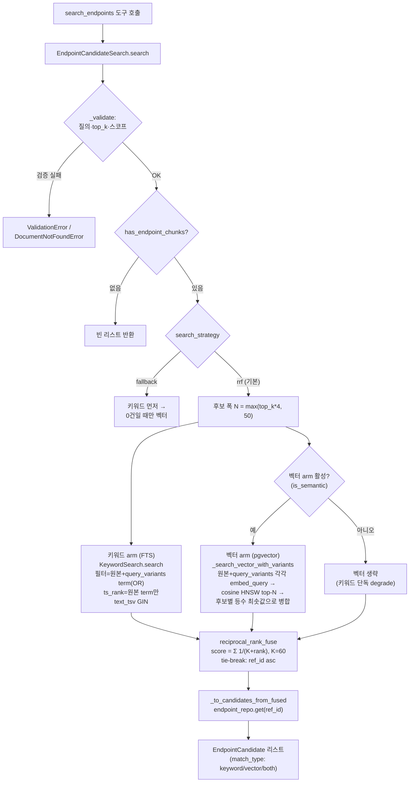
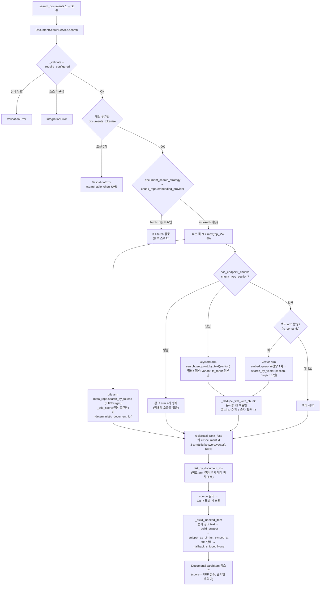
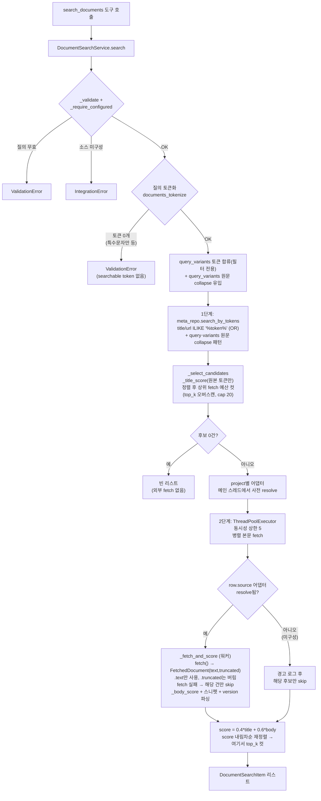

# 검색 로직 전체 흐름 (search-flow)

> **⚠️ 유지보수 안내 — 이 문서는 "살아있는 문서"다.**
> 검색 로직을 바꾸면 이 문서도 **같은 커밋에서 함께 갱신**해야 한다. 갱신 대상 코드:
>
> - `app/services/search/` (엔드포인트 검색: `endpoint_candidate_search.py`, `keyword_search.py`, `vector_search.py`, `rrf.py`, `tokenize.py`)
> - `app/services/documents/` (협업문서 검색: `document_search_service.py`, `search_scorer.py`, `snippet_generator.py`, `document_body_indexer.py`의 `deterministic_document_id` — 융합 키 계산)
> - `app/repositories/chunk_repository.py` (FTS·벡터 SQL), `app/repositories/document_meta_repository.py` (문서 메타 ILIKE 필터)
> - `app/models/chunk.py` (`TEXT_TSV_EXPRESSION`, `text_tsv` 생성 컬럼·GIN 인덱스), `app/composition.py` (조립), `app/core/config.py` (전략 플래그)
>
> 코드와 이 문서가 어긋나면 신규 참여자가 잘못된 그림을 갖게 된다. **코드가 진실, 문서는 그 요약**임을 전제로, 흐름·파일·함수 위치가 바뀌면 반드시 반영한다.
>
> 인용한 `파일:라인`은 갱신 시점 기준이다. 함수·상수 **이름**이 1차 좌표이고 라인 번호는 보조 힌트로 읽는다.

- 최종 갱신: 2026-08-15 (architect: 협업문서 검색 `indexed` 전략(3-arm RRF) §3 신규 기술 — 기본값이 `fetch`→`indexed` 로 전환됨(커밋 2d5cb26), 기존 fetch 경로는 §3.4~3.5 롤백 스위치로 격하)
- 작성: architect
- 관련 설계 근거: `docs/architect-review/07_search_rrf_reevaluation.md`(RRF), `docs/architect-review/04_search_p1_keyword_fts_design.md`(키워드 FTS), `docs/architect-review/03_search_performance_improvements.md`(P1~P6), `docs/architect-review/10_collab_docs_search_fixes.md`(항목1~6: version 파싱, truncated 노출 등), `docs/architect-review/12_rag_depth_directions.md`(후보4: query_variants 확장), `docs/architect-review/29_search_quality_eval_real_corpus_results.md`(§7.2: query_variants 벡터 arm 라우팅), `docs/architect-review/37_document_search_phase3_rrf_verdict.md`(문서 검색 3-arm RRF 채택), `docs/architect-review/41_backfill_result_verification_and_indexed_default_gate.md`(`indexed` 기본값 전환 승인)

---

## 1. 개요 — 두 개의 독립 검색 경로

이 프로젝트에는 **서로 완전히 독립된 두 검색 경로**가 있다. 대상 데이터·저장 방식·랭킹 전략이 다르므로 코드도 서비스도 분리돼 있다.

| 구분        | 엔드포인트 검색                                                 | 협업문서 검색                                               |
| ----------- | --------------------------------------------------------------- | ----------------------------------------------------------- |
| 서비스      | `EndpointCandidateSearch`                                       | `DocumentSearchService`                                     |
| MCP 도구    | `search_endpoints` (`app/mcp/tools/endpoints.py:30`)            | `search_documents` (`app/mcp/tools/documents.py:130`)       |
| 대상 데이터 | OpenAPI 문서에서 색인된 **endpoint 청크**(`chunk` 테이블, DB 내부) | Drive/Notion 문서의 **메타(제목/URL) + 색인된 section 청크**(`chunk` 테이블) |
| 저장·인덱스 | Postgres: FTS(`text_tsv` GIN) + 벡터(`embedding` HNSW)          | 같은 테이블·같은 인덱스(`chunk_type="section"`) + `document_meta`(pg_trgm GIN). **원문 전체는 미저장** — 실시간 조회는 `get_document` 전용 |
| 랭킹 전략   | **키워드 + 벡터를 RRF로 항상 융합**(기본 `rrf`)                 | **제목 + 키워드 + 벡터 3-arm RRF**(기본 `indexed`). 롤백용 `fetch` 는 제목 1단계 → 본문 실시간 fetch 2단계 가중합 |
| 특징        | 두 신호 순위 융합, 사내 데이터라 저지연                         | 융합 키가 청크가 아니라 `Document.id`. 검색 경로에 외부 API 호출이 없다(`indexed` 기준) |

조립은 `app/composition.py`의 `build_services()`에서 이뤄진다(`candidate_search` 라인 207, `document_search_service` 라인 240).

---

## 2. 엔드포인트 검색 — 키워드 + 벡터 RRF 융합

`EndpointCandidateSearch.search` (`app/services/search/endpoint_candidate_search.py:116`)가 진입점이다.
**후보 식별 정보만**(endpoint_id·method·path·summary·match_type) 반환하고, 상세(파라미터·응답)는 `get_endpoint_details`가 담당한다.

### 2.1 전략 두 가지

`DOCS_MCP_SEARCH_STRATEGY` env(`app/core/config.py:40`, 기본 `rrf`)로 결정:

- **`rrf`(기본)**: 키워드·벡터 두 ranker를 **항상 병렬 실행**해 RRF로 융합. → `_search_rrf` (`:163`)
- **`fallback`(롤백 스위치)**: 키워드를 먼저 하고 **정확히 0건일 때만** 벡터를 보조로. 옛 SPEC Phase 0 결정 6번 동작. → `_search_fallback` (`:147`)

인식 못 하는 값은 안전하게 `rrf`로 degrade한다(문자열 비교 분기).

### 2.2 rrf 전략 단계별 흐름

1. **입력 검증·스코프 확정** — `_validate` (`:222`). 빈 질의·top_k 범위(1~50) 체크, `document_id`/`project` 스코프 해석(미등록 document_id는 `DocumentNotFoundError`로 구분).
2. **endpoint 청크 존재 확인** — `chunk_repo.has_endpoint_chunks` (`chunk_repository.py:121`). 스코프에 endpoint 청크가 아예 없으면 검색·임베딩 없이 즉시 `[]`.
3. **후보 폭 N 계산** — `width = max(top_k * 4, 50)` (`:172`, 상수 `_CANDIDATE_WIDTH_MULTIPLIER=4`, `_MIN_CANDIDATE_WIDTH=50`). 정답이 한쪽 arm 상위에만 있어도 융합에서 건지도록 top_k보다 넓게 조회한다.
4. **키워드 arm(FTS)** — `KeywordSearch.search` (`keyword_search.py:38`)
   - 질의를 `tokenize_terms`(`keyword_search.py:13`, 정규식 `[0-9A-Za-z_]+|[가-힣]+`, 소문자화)로 term 분해. 호출자(Claude)가 `CandidateSearchOptions.query_variants`로 동의어/유사 표현을 넘기면 같은 토크나이저로 분해해 필터 term 에 합류시킨다(**docs/architect-review/12_rag_depth_directions.md** 후보4 — 협업문서 검색과 동일 규약: variant는 필터만 넓히고 점수엔 안 섞는다).
   - `chunk_repo.search_endpoint_by_text` (`chunk_repository.py:140`): 필터 term(원본+variant)들을 `|`(OR)로 결합해 `to_tsquery('simple', ...)`를 만들고, `chunk.text_tsv` **GIN 인덱스**(`ix_chunk_text_tsv`)에 `@@` 매칭. 각 term은 리터럴 lexeme으로 인용(`_quote_tsquery_lexeme`, tsquery 연산자 오인 방지). **`ts_rank` 점수는 별도 `score_terms`(원본 질의 term만, `query_variants` 생략 시 필터 term과 동일)로 계산**해, variant 매칭만 있는 후보가 원본 매칭 후보보다 부당하게 높은 순위를 받지 않게 한다. 정렬은 그 점수 내림차순, 동점이면 `id` 오름차순(결정적). 스코프(document_id/project)는 SQL WHERE + `Document` JOIN으로 필터.
   - `text_tsv`는 `TEXT_TSV_EXPRESSION`(`app/models/chunk.py:26`)으로 채워지는 STORED generated 컬럼 — ASCII↔한글 경계에 공백을 삽입한 뒤 `to_tsvector('simple', ...)`로 만든다(한글 단어·경로 세그먼트·혼합복합어 매칭).
   - 결과에서 `ref_id`(=endpoint_id) 순위 리스트를 뽑는다.
5. **벡터 arm(pgvector HNSW)** — 벡터 arm이 활성(`vector_fallback_enabled=True`, 즉 `is_semantic` 임베딩)일 때만:
   - **스코프가 지정된 경우에만**(`document_id` 또는 `project` 중 하나라도 있을 때) `chunk_repo.list_endpoint_chunk_ids` (`chunk_repository.py:104`)로 후보 ID 집합을 조회한다. 전역 검색이면 `candidate_ids=None` 으로 두어 불필요한 ID 적재를 피한다.
   - **원본 질의 + `query_variants` 를 각각 임베딩해 벡터 검색하고, 후보별 등수의 최솟값으로 병합한다** — `_search_vector_with_variants` (`:199`). 교차언어 질의(한글 원본 + 영문 변형)에서 벡터 arm이 원본만으로는 약하고 동일언어 변형에서 강해지는 사례를 놓치지 않기 위한 것이다(근거: `docs/architect-review/29_search_quality_eval_real_corpus_results.md` §7.2). 변형이 없으면 원본 1회 검색과 동일하게 동작한다. 이 arm에서도 **variant는 후보를 넓히는 데만 쓰이고 점수(등수)는 각 질의의 자체 순위**이며, RRF에 넘기는 것은 순위 리스트뿐이라 원본/변형 어느 쪽 점수도 직접 섞이지 않는다.
   - `VectorSearch.search` (`vector_search.py:32`): 질의를 `embedding_provider.embed_query`로 임베딩(로컬 `multilingual-e5-small`, `query: ` 접두사 — `_QUERY_PREFIX`, `embedding_provider.py:27`, 적용부 `:216`). 로컬 provider는 같은 질의 재임베딩을 피하려 **쿼리 임베딩을 LRU 캐시**한다(`LocalEmbeddingProvider`, `functools.lru_cache`, 장수 `AppState`에 상주) — 변형까지 각각 임베딩하는 위 병합이 감당 가능한 이유가 이 캐시다.
   - `chunk_repo.search_by_vector` (`chunk_repository.py:263`): 쿼리 실행 직전 `SET LOCAL hnsw.ef_search = max(100, top_k)`(`_HNSW_EF_SEARCH=100`, 트랜잭션 스코프)로 넓은 후보폭에서도 HNSW recall을 확보한다. 이어 pgvector 코사인 거리(`<=>`, `embedding` 컬럼의 **HNSW 인덱스** `ix_chunk_embedding_hnsw`/`vector_cosine_ops`)로 top-N, 유사도=`1-거리`. `ref_id`를 SQL로 함께 프로젝션(역매핑용 전체 적재 불필요). `candidate_ids IN (...)`로 후보 제한.
   - 점수 0 이하 후보는 제외하고 `ref_id` 순위 리스트를 뽑는다.
   - 벡터 arm 비활성(해시 폴백 등 `is_semantic=False`)이면 이 단계를 조용히 생략하고 **키워드 단독 순위로 degrade**.
6. **RRF 융합** — `reciprocal_rank_fuse` (`rrf.py:42`)
   - 각 arm에서 `ref_id` 첫 등장 기준 1-based 등수 부여(`_dedupe_first`).
   - `score(ref) = Σ_arm 1/(K + rank_arm(ref))`, `K=60`(`RRF_K`, 상수 고정·env 미노출). 해당 arm에 없으면 그 항은 0.
   - `match_type`: 양쪽 등장=`both`, 키워드만=`keyword`, 벡터만=`vector`.
   - 정렬: score 내림차순, **동점이면 ref_id 오름차순**(결정적 tie-break — 골든 회귀 테스트 전제). top_k로 컷.
7. **DTO 변환** — `_to_candidates_from_fused` (`:315`). `endpoint_repo.get(ref_id)`로 method/path/summary를 채워 `EndpointCandidate` 리스트 반환. 참조 깨진 ref_id는 경고 로그 후 건너뜀.

### 2.3 mermaid — 엔드포인트 검색(rrf)

---

## 3. 협업문서 검색 — 제목 + 본문 청크 3-arm RRF

`DocumentSearchService.search` (`app/services/documents/document_search_service.py:222`)가 진입점이다.

### 3.1 전략 두 가지

`DOCS_MCP_DOCUMENT_SEARCH_STRATEGY` env(`app/core/config.py:44`, 기본 `indexed`)가 `composition.py:246`에서 생성자로 주입돼 결정된다:

- **`indexed`(기본)**: title(`document_meta`) + keyword/vector(`chunk_type="section"` 본문 청크) **3-arm RRF**. → `_search_indexed` (`:474`)
- **`fetch`(롤백 스위치)**: 제목 매칭으로 후보를 압축한 뒤 후보 본문을 **실시간 병렬 fetch** 해 가중합. 백필 이전 기본값. → `_select_candidates`(`:336`) + `_rank_with_body`(`:382`)

**degrade 방향이 엔드포인트 경로와 반대다.** 미인식 값이거나 `chunk_repo`/`embedding_provider` 가 주입되지 않았으면 `fetch` 로 degrade한다(`:249-256`) — 롤아웃 중에는 검증된 옛 경로가 안전한 쪽이라는 판단(`docs/architect-review/39` §2.7).

기본값이 `fetch`→`indexed` 로 뒤집힌 근거(`docs/architect-review/43` §2): 본문 백필 결과 **텍스트를 뽑을 수 있는 문서의 색인률이 100%(136/136)** 였고, 텍스트를 못 뽑는 바이너리(이미지·영상 등 135건)는 `fetch` 전략에서 fetch 실패로 결과에서 **탈락하던** 것이 `indexed` 에서는 title arm으로 정상 노출되는 순개선이라 회귀 방향 케이스가 없었다.

### 3.2 indexed 전략 단계별 흐름

앞의 1~2는 두 전략이 공유하는 진입 검증이다.

1. **검증·소스 구성 확인** — `_validate`(`:636`)/`_validate_source`(`:648`)/`_require_configured`(`:661`). "결과 0건"과 "소스 미설정"을 구분하기 위해, 소스가 하나도 구성 안 됐으면 `IntegrationError`.
2. **질의 토큰화·필터 토큰 확장** — `documents_tokenize`(`search_scorer.py`)로 질의 토큰 집합 생성. **토큰이 하나도 안 나오면**(특수문자만인 질의 등) `search()`(`:243-245`)가 `ValidationError("query must contain at least one searchable token")`를 던진다 — 조용히 빈 리스트를 돌려주지 않는다. 호출자(Claude)가 넘긴 `query_variants`(동의어)는 `_variant_tokens`(`:326`)로 토큰화해 **후보 필터에만** 합류시킨다. 점수는 항상 원본 질의 토큰만으로 계산한다.
3. **후보 폭 N 계산** — `width = max(top_k * 4, 50)`(`:492`, 상수 `_RRF_CANDIDATE_WIDTH_MULTIPLIER=4`, `_RRF_MIN_CANDIDATE_WIDTH=50`, `:59-60`). 엔드포인트 경로와 **동일 규칙**(`docs/architect-review/39` §2.1).
4. **title arm** — `_title_arm` (`:569`)
   - `meta_repo.search_by_tokens` (`document_meta_repository.py:63`): `document_meta`의 title/url에 대해 토큰별 `ILIKE '%token%'` 를 OR로 결합(+ `queries`의 각 문자열—원본 질의와 variant 원문—을 공백 제거한 `collapse` 패턴도 OR, 중복 collapse 값은 dedup). title/url에는 **pg_trgm GIN 인덱스**(`ix_document_meta_title_trgm`/`ix_document_meta_url_trgm`, `gin_trgm_ops`)가 있어 선행 와일드카드 ILIKE도 인덱스로 처리된다. 스코프(source/project)는 SQL WHERE.
   - `_title_score`(원본 토큰만)로 채점 후 (원본 매치 여부 내림차순, title_score 내림차순, external_id) 정렬 → 상위 `width` 건.
   - **문서 ID는 `deterministic_document_id(project, source, external_id)`(`document_body_indexer.py:31`)로 순수 계산**한다. `document_meta.document_id` 가 NULL(미색인)이어도 같은 값이 나오므로, 청크 arm의 `Chunk.document_id` 와 같은 키 공간에서 만난다(`docs/architect-review/39` §2.2). **미색인 문서가 title arm 단독으로 결과에 살아남는 장치가 이것이고, 그래서 별도 폴백 분기가 없다**(같은 문서 §2.3).
5. **section 청크 존재 게이트** — `chunk_repo.has_endpoint_chunks(project=..., chunk_type="section")` (`chunk_repository.py:106`). 스코프에 section 청크가 0건이면 keyword/vector arm을 **둘 다 생략**하고(질의 임베딩 호출도 생략) title 단독 순위로 간다.
6. **keyword arm(FTS)** — `_keyword_arm` (`:603`) → `chunk_repo.search_endpoint_by_text` (`chunk_repository.py:129`, 엔드포인트 경로와 **같은 함수**를 `chunk_type="section"` 으로 재사용). 필터 term은 원본+variant 토큰, `score_terms` 는 원본 토큰만 — variant 매칭만 있는 청크가 부당하게 높은 순위를 받지 않게 하는 규약이 여기서도 같다. `chunk.text_tsv` GIN 인덱스에 `@@` 매칭, `ts_rank` 내림차순·`id` 오름차순.
7. **vector arm(pgvector HNSW)** — `_vector_arm` (`:617`), `vector_fallback_enabled=True`(`is_semantic` 임베딩)일 때만.
   - `embedding_provider.embed_query` 는 **요청당 1회**만 호출한다 — 후보마다 임베딩을 부르는 N+1 이 반려안 (A)의 핵심 결함이었다(`docs/architect-review/39` §1.2).
   - `chunk_repo.search_by_vector`(`chunk_repository.py:193`)에 `chunk_type="section"` 과 **`project` 스코프를 직접 넘겨 SQL 조인으로 거른다.** 엔드포인트 경로처럼 `candidate_ids` 집합을 만들지 않는다 — section 청크는 문서 수 × 섹션 수라 `IN` 절이 부푼다(`docs/architect-review/39` §2.6).
   - 점수 0 이하 후보는 제외.
   - **엔드포인트 경로와 달리 이 arm은 `query_variants` 를 받지 않는다**(원본 질의 1회 임베딩만).
8. **arm 결과 접기** — `_dedupe_first_with_chunk` (`:93`): 두 청크 arm 모두 **문서별 첫 히트만** 남겨 문서 ID 순위 리스트 + 문서별 승자 청크 ID를 만든다. 한 문서가 섹션 수만큼 결과 슬롯을 먹지 않게 하는 장치다.
9. **RRF 융합** — `reciprocal_rank_fuse(keyword_ids, vector_ids, top_k=width, title_ref_ids=title_ids)` (`rrf.py:42`). 엔드포인트 경로와 **같은 함수·같은 `K=60`**, 다른 점은 (a) 융합 키가 `endpoint_id` 가 아니라 `Document.id` 라는 것과 (b) `title_ref_ids` 로 3번째 arm이 붙는다는 것뿐이다. 융합 결과가 0건이면 즉시 `[]`(`:511-513`).
10. **표시용 메타 보강** — 청크 arm에만 걸린 문서(=제목엔 안 걸리고 본문에만 걸린 문서)는 title arm이 메타를 갖고 있지 않다. `document_id` 는 해시라 역산이 불가하므로 `meta_repo.list_by_document_ids` (`document_meta_repository.py:128`)로 **배치 1회** 조회한다(문서당 조회 금지, `docs/architect-review/39` §2.2).
11. **source 필터 + top_k 컷** — 청크 arm은 `project` 만 SQL 스코프로 걸고 `source` 는 걸지 않으므로, 융합 뒤 `row.source` 로 걸러낸다(`:530-531`). 순서대로 담다가 `top_k` 에 도달하면 중단. 메타를 못 찾은 ref_id는 경고 로그 후 건너뛴다.
12. **스니펫·점수** — `_build_indexed_item` (`:540`)
    - 승자 청크가 있으면 그 text(`chunk_repo.get_texts_by_ids` 로 **배치 1회** 조회, `chunk_repository.py:252`)로 `_build_snippet`, `snippet_as_of = row.last_synced_at`. keyword·vector 양쪽에 걸리면 **keyword 쪽 승자 청크가 이긴다**(`{**vector, **keyword}`, `:521`).
    - title arm 단독 문서는 `_fallback_snippet(row, query)` + `snippet_as_of=None`(스니펫이 본문 발췌가 아니므로).
    - 스니펫 출처가 라이브 원문이 아니라 **동기화 시점 캐시**가 되는 것이 doc36 Phase0-2가 예고한 **유일한 겉면 계약 변경**이고, `snippet_as_of` 가 그것을 명시하는 필드다. 다만 이 필드는 아직 서비스 DTO(`DocumentSearchItem`)에만 있고 **MCP 응답 페이로드에는 실리지 않는다**(`app/mcp/payloads.py:119`) — 호출 LLM 은 현재 스니펫의 신선도를 알 수 없다.
    - `score` 는 RRF 점수 원본(`0.0x` 스케일)이다. `fetch` 전략의 `[0,1]` 가중합과 **절대값 비교가 불가능하고 순서 정보만 의미가 있다**(`docs/architect-review/39` §2.5). `match_type` 은 문서 검색 계약에 없어 추가하지 않았다.

**이 경로에는 라이브 fetch가 없다.** 본문 신호는 전부 동기화 시점에 색인된 section 청크에서 온다(색인은 `refresh_documents --index-bodies`). 실시간 원문 조회는 `get_document`(`:268`) 전용이다.

### 3.3 mermaid — 협업문서 검색(indexed, 기본)

---

### 3.4 fetch 전략(롤백 스위치) — 메타 1단계 → 병렬 fetch 2단계

`DOCS_MCP_DOCUMENT_SEARCH_STRATEGY=fetch` 일 때만 타는 **이전 기본 경로**다. 본문을 캐시하지 않고 매 검색마다 외부에서 가져오므로 스니펫이 항상 최신이지만(그래서 `snippet_as_of` 가 `None`), 외부 fetch 비용이 크고 fetch 실패 문서(바이너리 등)가 결과에서 통째로 탈락한다. 코드는 doc36 13번(구경로 삭제)이 실사용 확인 후로 보류돼 있어 그대로 남아 있다.

#### 3.4.1 1단계 — 메타 캐시 후보 압축 (무료·빠름)

1. 진입 검증은 §3.2 1~2와 동일하다. 토큰화와 별개로 `query_variants` **원문**도 `_select_candidates`가 `queries=[query, *query_variants]`로 실어 보낸다(공백 유무 차이는 토큰화를 거치면 사라지므로 collapse 매칭에는 원문이 필요).
2. **SQL 후보 조회** — `meta_repo.search_by_tokens`. §3.2 4번의 title arm과 **같은 호출**이다(ILIKE + collapse 패턴 + pg_trgm GIN).
3. **후보 점수·정렬·컷** — `_select_candidates` (`:336`): `_title_score`(원본 토큰만)로 채점 후 (원본 매치 여부 내림차순, title_score 내림차순, external_id) 정렬 → **상위 fetch 예산 건만** 남긴다. 예산은 `_body_fetch_budget(top_k, candidate_count)`(`:66`)가 정한다: `overscan = min(top_k*BODY_FETCH_OVERSCAN, MAX_BODY_FETCH_CANDIDATES)`(각각 3, 20), `budget = min(max(top_k, overscan), candidate_count)` — top_k보다 넓게 오버스캔하되 상한을 씌우고, top_k 자체보다는 작아지지 않으며, 후보 수를 넘지 않는다. 예산이 부족하면 원본 신호 있는 행이 먼저 자리를 채우고 variant-only 매치는 남는 자리만 채운다. **최종 top_k 컷은 여기가 아니라 2단계(`_rank_with_body`)가 본문 점수까지 반영해서** 한다 — title_score만으로 top_k 컷을 확정하지 않기 위한 것이 이 예산 확장의 목적.
4. **후보 0건이면 즉시 종료** — 외부 API를 **한 번도 호출하지 않고** 빈 리스트 반환(`:261-264`).

#### 3.4.2 2단계 — 후보 본문 실시간 병렬 fetch (비쌈)

`_rank_with_body` (`:382`):

1. **어댑터 사전 resolve(메인 스레드)** — 후보에 등장하는 project별로 `resolver.resolve_for_project`를 **미리** 호출해 둔다. 이 호출은 요청-스코프 SQLAlchemy Session을 읽어 스레드 세이프하지 않으므로 워커에 맡기지 않는다.
2. **병렬 fetch** — `ThreadPoolExecutor(max_workers=min(len(candidates), MAX_CONCURRENT_BODY_FETCHES))`. **동시성 상한 `MAX_CONCURRENT_BODY_FETCHES=5`**(`:85`)가 Drive/Notion rate limit·지연 합산을 막는 핵심 장치다. `executor.map`은 입력 순서로 결과를 모아 스레드 안전.
3. **건별 fetch+채점** — `_fetch_and_score` (`:426`): 워커 스레드에서 순수 I/O인 `document_source.fetch()`만 수행. **후보의 `row.source`에 해당하는 어댑터가 1번에서 resolve된 `sources`에 없으면**(`sources.get(row.source) is None`, `:440-444`) `fetch()` 호출조차 없이 경고 로그 후 그 후보만 조용히 skip한다 — 메타 캐시엔 남아 있지만 해당 project의 소스 어댑터가 미구성된 경우로, 아래 `IntegrationError` 예외 경로와는 별개의 실패 분기다. `fetch()`는 평문 문자열이 아니라 `FetchedDocument(text, truncated)`(`sources/document_source.py:40`)를 반환한다(이 DTO가 `__post_init__` 에서 NUL(0x00)을 제거한다 — 어댑터 경계가 유일한 정화 지점, `docs/architect-review/42` §1) — 이 경로는 `.text`만 스니펫/점수 계산에 쓰고 **`.truncated`는 버린다**(스니펫은 원래 발췌라 절단 여부가 무의미; `truncated`는 `get_document` 원문 조회 경로에만 노출된다). **개별 fetch 실패는 그 문서만 건너뛴다**(한 건의 권한 오류가 검색 전체를 죽이지 않음, `None` 반환). 성공 시 `_body_score`(원본 토큰) + 스니펫(`_build_snippet`/`_fallback_snippet`) 생성 + `DocumentSearchItem.version = parse_version(row.title)`(제목에서 버전 표기 파싱, 없으면 None — **순위 계산에는 영향 없음**, 노출용 필드).
4. **최종 점수·정렬·top_k 컷** — `score = round(0.4*title_score + 0.6*body_score, 4)`(`TITLE_SCORE_WEIGHT=0.4`). fetch 순서와 무관하게 (score 내림차순, title) 재정렬한 뒤 **여기서 비로소 상위 top_k만** 남겨 반환한다(`items[:top_k]`) — 1단계에서 fetch 예산만큼 살아남은 후보가 본문 점수까지 반영해 재평가된 결과다.

### 3.5 mermaid — 협업문서 검색(fetch, 롤백 스위치)

---

## 4. 두 경로의 공통 원칙 (설계 메모)

- **스코프 필터는 SQL로** — 두 경로 모두 document_id/project/source 범위를 Python이 아니라 SQL WHERE(+JOIN)로 좁힌다. 전체 행을 메모리에 적재하지 않는다.
- **질의 확장은 호출측 LLM의 몫** — 서버는 동의어/약어 확장을 위해 별도 LLM을 호출하지 않는다. 호출자가 넘긴 `query_variants`를 쓸 뿐이다(`docs/architect-review/12_rag_depth_directions.md` 후보4).
- **variant는 후보를 넓히고, 점수는 원본이 정한다** — 두 경로의 키워드 신호(FTS OR / ILIKE)는 `query_variants`로 후보 필터만 넓히고 점수는 **원본 질의 토큰만으로** 계산한다. 엔드포인트 검색의 벡터 arm은 `query_variants`를 **받는다**(§2.2 5번, `docs/architect-review/29_search_quality_eval_real_corpus_results.md` §7.2) — 교차언어 질의에서는 벡터 arm이 유일한 신호인데 원본 질의만으로는 약해서다. 이때도 원본과 변형의 점수를 가중합하지 않고 **각 질의의 자체 등수 중 최솟값**만 취해 RRF에 순위로 넘기므로, "variant가 점수를 밀어 올리지 않는다"는 규약은 유지된다. **협업문서 검색의 벡터 arm은 아직 variant를 받지 않는다**(§3.2 7번) — 두 경로의 유일한 비대칭이며, 필요해지면 엔드포인트 경로의 등수 최솟값 병합을 그대로 이식하면 된다.
- **RRF는 두 경로의 공통 랭킹 축이고, 다른 것은 융합 키뿐이다** — 엔드포인트는 `endpoint_id`(`ref_id`), 협업문서는 `Document.id`. 같은 `reciprocal_rank_fuse`·같은 `K=60`·같은 후보 폭 규칙(`max(top_k*4, 50)`)을 쓰고, 청크 저장소도 `chunk` 테이블 하나를 `chunk_type`(`endpoint`/`section`)으로 나눠 쓴다. 가중합을 쓰지 않는 이유는 두 경로가 같다 — `ts_rank`와 코사인 유사도는 정규화 기준이 없어 합칠 수 없다(`docs/architect-review/07_search_rrf_reevaluation.md` 3·5절, `docs/architect-review/39` §1.3).
- **결정성** — 두 경로 모두 동점 tie-break를 고정 키(ref_id / document_id / external_id / title)로 못박아 결과가 결정적이다(엔드포인트 검색은 골든 회귀 테스트 전제).
- **스니펫 신선도의 계약 차이** — `indexed` 협업문서 검색의 스니펫은 **동기화 시점 캐시 발췌**라 `DocumentSearchItem.snippet_as_of`(=`document_meta.last_synced_at`)로 그 시점을 담는다(`fetch` 전략과 title-only 매치는 캐시 발췌가 아니므로 `None`). **이 필드는 아직 MCP 응답에 실리지 않아 호출 LLM 에는 보이지 않는다** — §3.2 12번. 원문 자체는 어느 전략에서도 캐시하지 않는다 — `get_document`는 항상 fetch 시점의 최신 본문이다.
- **"없음"의 구분** — 미등록 document_id·미구성 소스는 빈 결과가 아니라 명시적 오류로 구분해, 호출 LLM이 "문서 없음"과 "결과 없음"을 혼동하지 않게 한다.
